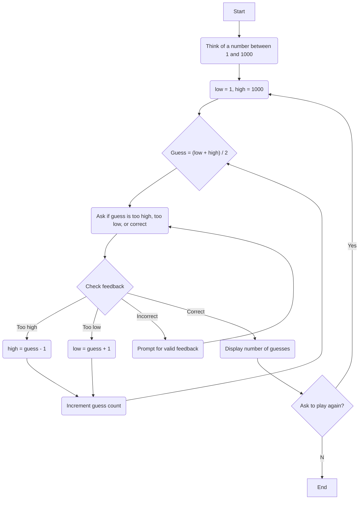

<!--<--In the Reverse Guess the Number game, the computer takes on the role of the guesser, and the human player thinks of a number within a defined range.
The objective for this task is to create a flowchart that outlines the logical steps the computer should take to efficiently guess the number using a binary search algorithm. 
1.	The player is prompted to think of a number within a specified range (e.g., between 1 and 1000). 
2.	The computer attempts to guess the number. 
3.	After each guess, the player informs the computer whether the guess was too high, too low, or correct. 
4.	The computer uses the feedback to adjust its next guess, narrowing down the possible range based on binary search principles. 
5.	The process continues until the computer guesses the correct number. 
Requirements: 
Implement a binary search approach where the computer's guess is always the middle of the current possible range. 
Ensure that the player's responses are valid (i.e., 'high', 'low', or 'correct'). If the response is invalid, prompt for a valid response. 
Based on the player's feedback, adjust the range of possible numbers for the next guess. 
Track and display the number of guesses made by the computer. 
After the correct number is guessed, ask the player if they want to play again. Restart the game if yes, and end the program if no.  -->

