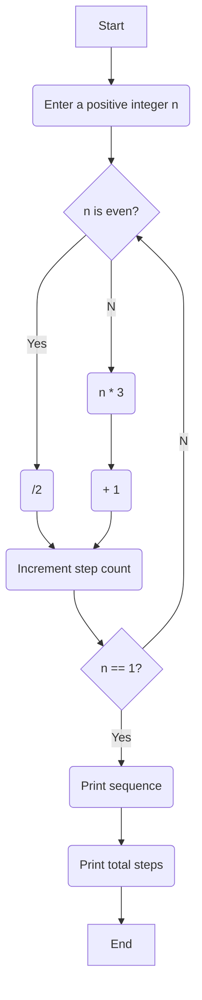

<!--<--The Collatz Conjecture, also known as the "3𝑛 + 1 problem", is a classic problem in mathematics and 
computer science that is simple to understand but remains unsolved. The conjecture asks whether repeating 
two simple arithmetic operations will eventually transform every positive integer into 1. 
The rules are as follows:
Start with any positive integer 𝑛.
If 𝑛 is even, divide it by 2. 
If 𝑛 is odd, multiply it by 3 and add 1.
Continue this process until 𝑛 becomes 1. -->

