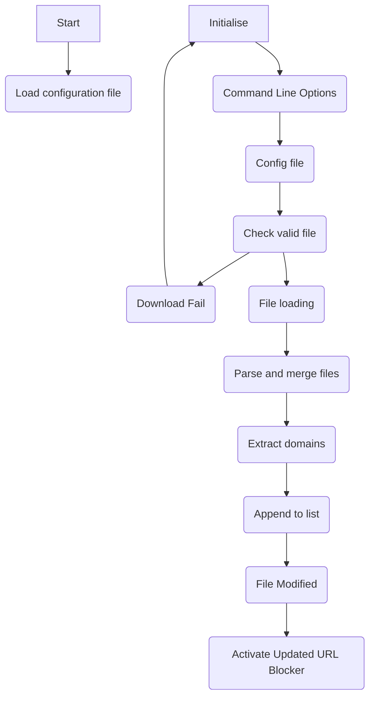

```mermaid
flowchart TD
    Start --> Initialize("Load configuration file")
    Initialise --> Parse-command-line-options("Command Line Options")
    Parse-command-line-options --> GetConfigFile("Config file")
    GetConfigFile --> Download-blocklist("Check valid file")
    Download-blocklist --> Download-fail("Download Fail")
    Download-blocklist --> Correct-file("File loading")
    Download-fail --> Initialise
    Correct-file --> Parse-merge("Parse and merge files")
    Parse-merge --> Regex("Extract domains")
    Regex --> CombineList("Append to list")
    CombineList --> ModifiedHostFile("File Modified")
    ModifiedHostFile --> End("Activate Updated URL Blocker") 
```
